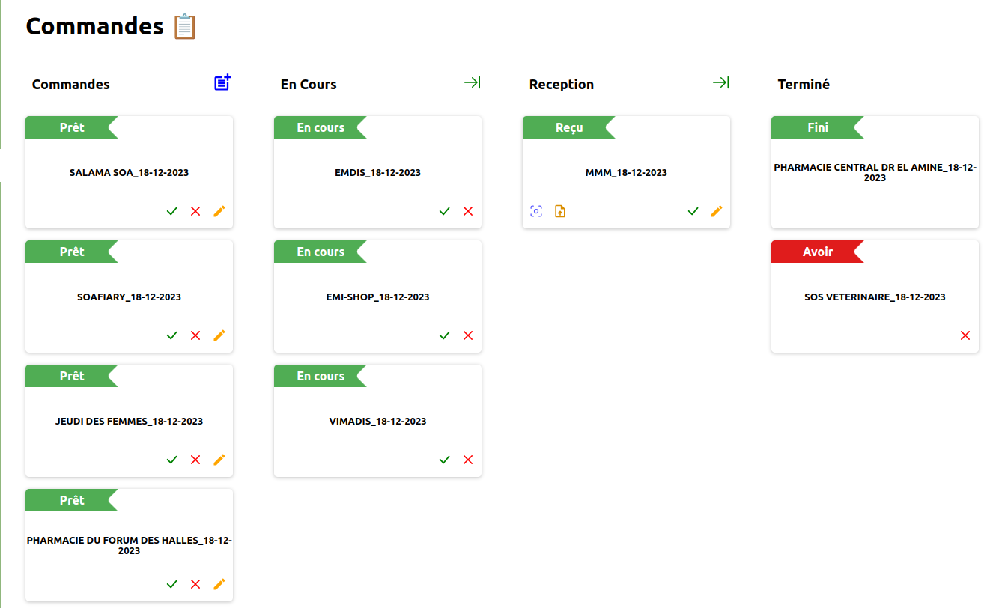

# SAGE Pharmacy

SAGE web application for pharmacy management.

## Features ✨

This application manages :

<ul>
    <li><a href="#inventory">inventory</a></li>
    <li><a href="#purchase">purchase</a></li>
    <li><a href="#commands">orders</a></li>
    <li><a href="#providers">providers</a></li>
</ul>

<em>ERD for database</em>

<h3 id="inventory">📦 Inventory</h3>
Stock/inventory page covers mostly CRUD operation. User can Create/Read/Update/Delete medicine entities from database.

<h3 id="purchase">🛒 Purchase</h3>
Purchase page displays suggestion based on futures stock and real stock found in database.

Table also displays a **select box** in case there are multiple matching between medicine from local invetory and medicine from provider.

<h3 id="commands">📝 Orders</h3>

The common-way to generate commands/orders is using the _purchase page_. From purchase page, quantity to order for each medicines are computed beforehand. That way, one has a wider overview about the command because we have to take in count that certain providers have certain prerequisites about the orders, either by **quantity** or **pricing**.

Orders have several status, displayed as _Kanban_ for simplicity.

<em>Orders list</em>

- **ORDERED** is the initial status of an order
- **PENDING** means that provider has been notified and they are processing the request. One can send mail directly from the app to notify the provider.
- **RECEIVED** means that items have been delivered. User can attach evidence (scan image or PDF) file to order.
- _terminal stage_ :
  - **AVOIR** means that some items include issue. (Wrong quantity, expired items, etc...)
  - **FINISHED** means that order has been succefully fulfilled.
- **ARCHIVED** means that order has been succefully fulfilled but datas might be used later.

<h3 id="providers">🏭 Providers</h3>
User can Create/Read/Update/Delete providers from database. Provider's medicine catalogue can be imported as CSV/XLSX file from the provider page.

Since we can not know each provider's catalogue file pattern, file has to follow some specific pattern in order to be deserialized.

Medicine in inventory and medicine from provider correspondance also has to be done by the user since we can not rely on medicine/item names. If we could, a simple _regex_ matching would have been sufficient.

<h3 id="providers">🧾 Dedicated page for bills</h3>

_Archive_ page displays list of archived orders with receipt/bill/evidence attached to them.

## Preview 🚧

[Preview](http://34.168.203.141) of the application is hosted on **Google Cloud**. Credentials :

- username : admin
- password : free

## TODOS 📝

- [ ] features for client interaction
- [ ] features for cashing
- [ ] personnel management

## Technologies used 🛠️

    
    
    
    
    
    

> Made with ❤️
